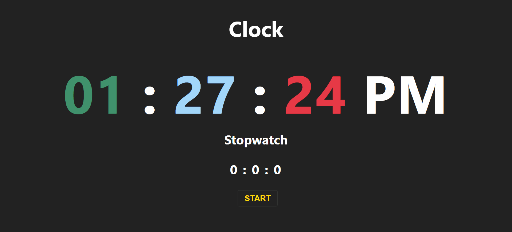

# Stopwatch

### Project Discription
 In this project you will see two react component, one is clock which shows you current time in you location and another one is a stop watch which you can start , stop and restart timer of stopwatch.

### Made by :- Deepanshu Gulia

### Tech stack :- 
 HTML | CSS | Javascript | Reactjs | vercel

## Image of project

